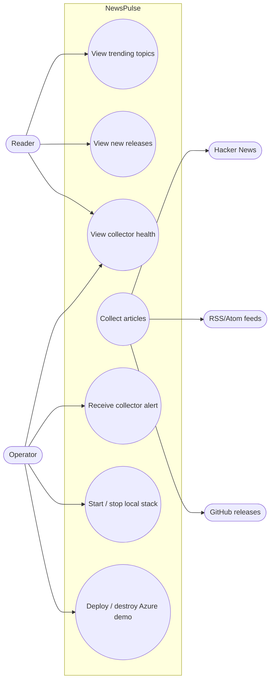

# Use case diagram

Who does what with NewsPulse (v1).

```mermaid
flowchart LR
    reader([Reader])
    operator([Operator])
    hn([Hacker News])
    rss([RSS/Atom feeds])
    gh([GitHub releases])

    subgraph NewsPulse
        uc1((View trending topics))
        uc2((View new releases))
        uc3((View collector health))
        uc4((Collect articles))
        uc5((Receive collector alert))
        uc6((Start / stop local stack))
        uc7((Deploy / destroy Azure demo))
    end

    reader --> uc1
    reader --> uc2
    reader --> uc3

    operator --> uc3
    operator --> uc5
    operator --> uc6
    operator --> uc7

    uc4 --> hn
    uc4 --> rss
    uc4 --> gh
```